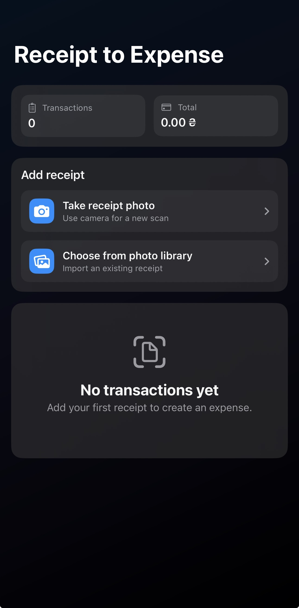
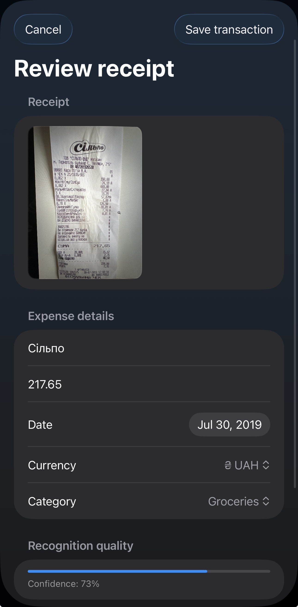
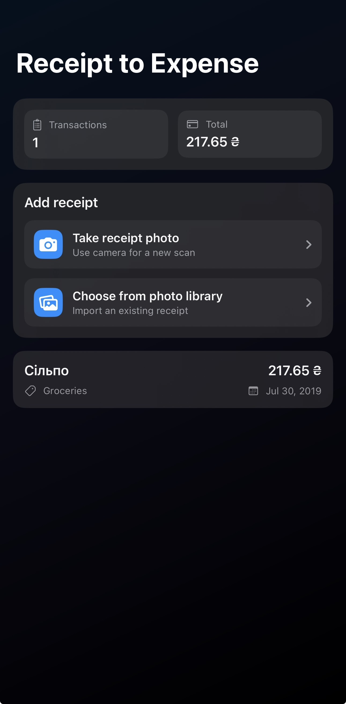

# ReceiptAI Parser

An iOS app built with SwiftUI and SwiftData that scans receipts, runs on-device OCR with Vision, extracts structured expense data with Google Gemini, and saves an editable transaction.

## Features

- Receipt capture from camera or photo library
- On-device OCR with Apple Vision
- Structured receipt parsing with Google Gemini
- Editable preview before saving
- Local persistence with SwiftData
- Unit tests with mocked HTTP requests

## Screenshots

  
  
  
  

## Requirements

- **Xcode** 16+ (project uses Swift 6–style defaults)
- **iOS** 17.6+ simulator or device
- A **Google AI Studio** API key ([get a key](https://aistudio.google.com/))

## Setup (first run)

1. Open `GeminiInfo.plist` in the project root (next to `ReceiptAI Parser.xcodeproj`).
2. Paste your API key into **GeminiAPIKey** (between `<string>` and `</string>`).
3. Optionally change **GeminiModel** (default is `gemini-3.1-flash-lite-preview`).
4. Build and run the **ReceiptAI Parser** scheme.

Never commit a real API key to a public repository.

## How it works (short)

1. User picks an image → **Vision** reads text.
2. **Gemini** `generateContent` returns strict JSON (shop, amount, date, currency, category).
3. User can edit the extracted fields before the expense is saved with **SwiftData**.

## Architecture

| Layer | Role |
|--------|------|
| **SwiftUI** | `ContentView` hosts the list, capture UI, preview sheet, and binds to `ReceiptFlowViewModel`. |
| **`ReceiptFlowViewModel`** (`@MainActor`) | Orchestrates the flow: image → OCR → parse → draft fields → save via `ExpenseStore` + `ModelContext`. |
| **`ReceiptOCRService`** | `Vision` (`VNRecognizeTextRequest`): image → plain text + average confidence. |
| **`AIReceiptParsingService`** | Calls Gemini REST (`models:list` when possible, then `generateContent`) with **JPEG + OCR text**, maps JSON into `ParsedReceiptData`. |
| **`ReceiptParsingService`** | Regex/heuristic parser — **not** wired in the main app path; kept for tests and experiments. |
| **SwiftData** | `ExpenseTransaction` persisted through `ModelContainer` configured in `ReceiptAI_ParserApp`. |

**Data flow (happy path):** `UIImage` → `ReceiptCaptureView` / `ImagePicker` → `processReceiptImage` → OCR → `parse(...)` → `ParsedReceiptData` → user edits in `ReceiptPreviewView` → `saveTransaction` → SwiftData store on disk (with in-memory fallback if the store fails to open).

## Known limitations

- **Network & API:** Parsing needs a live Gemini call; there is **no** offline AI fallback and no switch back to the local regex parser in production.
- **Secrets:** The API key is supplied via merged **Info** (`GeminiInfo.plist`). It is **not** safe against a determined reverse-engineer of the app bundle; use a key with tight quotas and treat it as a *client* secret.
- **Dashboard “Total”:** The summary adds amounts naïvely and shows one currency symbol; **mixed-currency** lists are not converted or split.
- **OCR & receipts:** Very poor images, glare, or faint thermal print can yield weak OCR; the model still gets the image, but garbage-in hurts extraction quality.
- **Simulator:** The camera button falls back to the photo library when no camera exists; behavior matches a device best with a real camera.
- **Tests:** `AIReceiptParsingServiceTests` mock HTTP only; `ReceiptParsingServiceTests` cover the local parser, not the full UI pipeline.

## Tests

**Product → Test** (`Cmd + U`). Tests use a fake HTTP stack (no real Gemini calls).